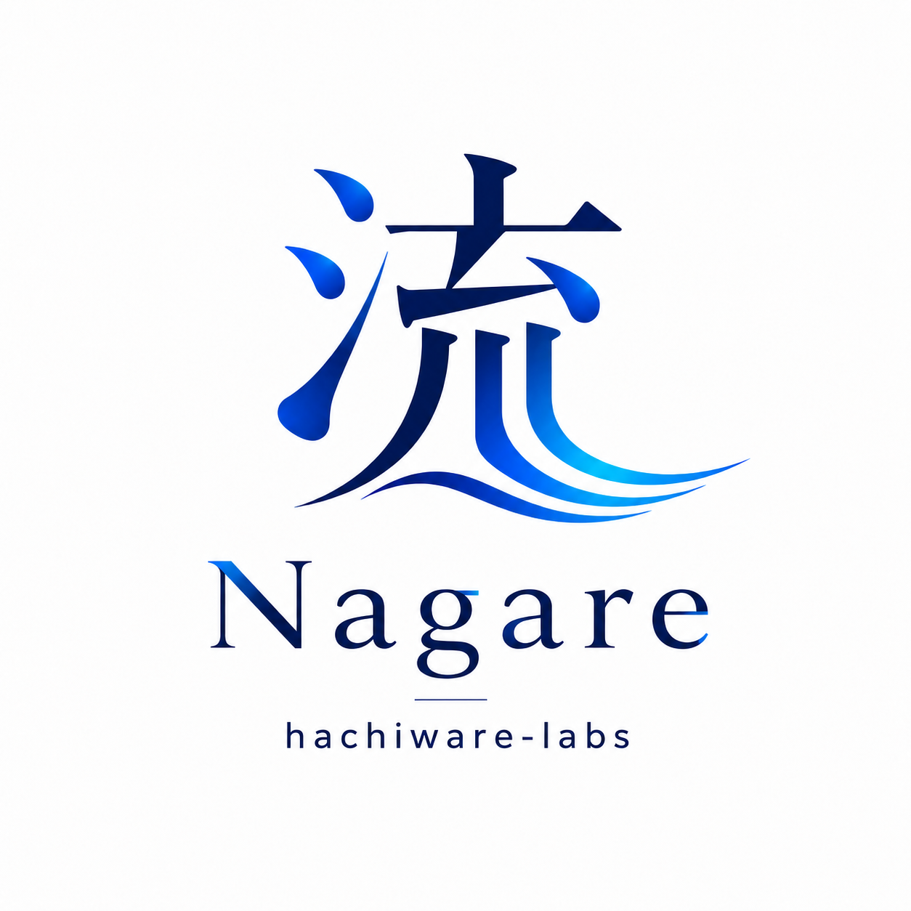

# Nagare / 流



[日本語 README](README_ja.md) | [Spec](docs/spec.md) | [Architecture](docs/architecture.md) | [Tutorial](docs/tutorial.md) | [日本語チュートリアル](docs/tutorial_ja.md)

Nagare is an adapter-first execution ledger for coding agents.

The goal is to keep work items, run packets, agent runs, artifacts, evidence,
review results, handoffs, and human decisions in one local-first control
layer while letting agent backends change underneath.

## Current Slice

This repository now includes the first end-to-end user scenario:

- initialize a local Nagare ledger
- register project-local Agent Profiles in `.nagare/agents/*.toml`
- create a work item
- run a failing `codex-cli` agent profile
- capture the failure as evidence
- create a handoff to `codex-app-server`
- run a succeeding retry
- review the work, including any CI/test/artifact checks
- approve it as a human decision
- reach `done`

## Local Development

```powershell
npm test
npm run build
nagare doctor
nagare init
```

`npm run build` builds the release CLI binary, stages it into the local npm
package, and links the workspace package globally so `nagare` runs the current
development build.

## First Scenario

Run the scenario as normal user commands:

```powershell
$env:NAGARE_ROOT = "$env:TEMP\nagare-first"
nagare init
nagare locale use --language en-US --timezone America/Los_Angeles
nagare agent add --id codex-impl-smoke --display-name "Codex CLI Smoke Implementer" --runtime codex-local --adapter process.codex-cli --role worker --working-dir . --description "Implementation and review checks" --specialties implementation,review-checks
nagare agent add --id codex-app-smoke --display-name "Codex App Server Smoke Implementer" --runtime codex-app-local --adapter stdio.codex-app-server --role implementer --working-dir . --description "Planning and review" --specialties planning,review
nagare agent list
nagare agent use --work-agent codex-impl-smoke --review-agent codex-app-smoke --dispatch-agent codex-impl-smoke
nagare agent defaults
nagare agent doctor codex-impl-smoke
nagare agent probe codex-impl-smoke
nagare item create --title "Repair failing agent run" --description "Demonstrate cross-agent evidence and handoff."
nagare item preview work_0001 --command "echo dispatch preview && exit /B 0"
nagare item dispatch accept work_0001
nagare item run work_0001 --command "echo codex run failed && exit /B 1"
nagare handoff create work_0001 --from-agent codex-impl-smoke --to-agent codex-app-smoke --reason "Codex agent profile produced a failing run" --summary "Retry with Codex App Server agent profile using the captured run log as evidence."
nagare item run work_0001 --agent codex-app-smoke --command "echo codex app server retry fixed the task && exit /B 0"
nagare item review work_0001 --agent codex-app-smoke --command "echo ## Nagare Review && echo verdict: pass && echo summary: && echo - review passed && echo completed: && echo - reviewed result and checks && echo findings: && echo - none && echo questions: && echo next_notes: && echo - ready for approval && echo next_action: approve"
nagare decision approve work_0001 --rationale "Required review passed after cross-agent handoff."
nagare item show work_0001
Remove-Item Env:\NAGARE_ROOT
```

Expected snapshot header:

```text
work_0001	done	Repair failing agent run
```

The scenario uses registered agent profile IDs while running local demo
commands. This keeps the first workflow deterministic while preserving the
adapter-first shape of the product. Unknown agent profile IDs are rejected.

## `nagare` Command

After installation, all user-facing flows are available through the `nagare`
command:

```powershell
nagare doctor
nagare init
nagare locale show
nagare agent list
nagare agent show codex-cli
nagare agent defaults
nagare agent doctor codex-cli
nagare agent probe codex-cli
nagare item preview work_0001
nagare item dispatch accept work_0001
nagare item review work_0001
nagare handoff dispatch work_0001
nagare item list
nagare item show work_0001
```

The npm package is only the installation/distribution path. The product
interface is the `nagare` command.

## Documentation Language Policy

User-facing README and tutorial documents are maintained in English and
Japanese pairs:

- `README.md` / `README_ja.md`
- `docs/tutorial.md` / `docs/tutorial_ja.md`

The canonical implementation architecture is maintained in Japanese:

- `docs/architecture.md`
- `docs/spec.md`
